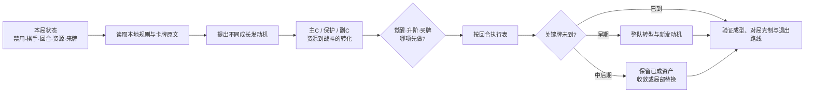

# wanxiang-build · 王者万象棋阵容构筑分析 Skill

本 Skill 适合不喜欢照搬官方构筑、热门构筑或固定棋手玩法的玩家，帮助你基于规则和卡牌资料构建属于自己的独特构筑。

该 Skill 将游戏原始资料连接到一套可解释、可量化的运营分析流程，并通过内置的多套门禁机制进行逻辑校验，避免 Agent “靠感觉”产出阵容推荐。

卡牌与规则资料来源于游戏对局记录、游戏内文档、游戏官网文档，以及[万象棋知识站](https://wanxiangqiwiki.com/)。不同来源的内容会在本地资料中交叉核对；当规则或字段存在未确认之处时，Skill 会保留假设和适用边界，不将策略推论冒充游戏规则。

快速入口：[Skill 指令](skills/wanxiang-build/SKILL.md) · [规则与资料边界](skills/wanxiang-build/references/sources.md) · [评分规则](skills/wanxiang-build/references/scoring.md) · [战斗转化评估](skills/wanxiang-build/references/combat-evaluation.md) · [觉醒 / 升阶机会成本](skills/wanxiang-build/references/investment.md)

## 更新摘要 · 2026-09-18

- 固化[精简关键词提取与增量维护](skills/wanxiang-build/references/keyword-tags.md)流程，支持新增、改版卡牌的标签整理，保留已核验标签的简洁粒度。
- 新增[初始构筑入口与棋手增益匹配](skills/wanxiang-build/references/initial-build-player-fit.md)：从21个A类标签检索，区分阵容母集与外挂组件，先分析构筑缺陷，再选择能补足短板的棋手。
- 收录新棋手阿离（官方ID20）的技能、秘技、专属及7张关联卡，补充各强化分支的适配条件；棋手资料增至19名。
- 同步核心玩法调整：庄小鱼「如梦似幻」使用能量8→6；始祖熊灵40级强化调整为35%减伤、50%攻速、持续5秒；镜6级天赋仅更新显示说明。此次不涉及拍卖优化。

## 如何使用

安装本 Skill 有两种方式。推荐在 Agent 对话中直接说：“帮我安装 [wanxiang-build](https://github.com/Cjy-CN/wanxiang-build) 这个 Skill”。也可以将本项目目录下的 `skills` 文件夹拖入你所使用的 Agent 工具的 Skill 目录；安装完成后重新打开或刷新会话即可使用。

### 从零构筑提问

```text
1.使用 $wanxiang-build。在禁用__阵营的前提下，从零设计一套构筑。
2.帮我设计一套最适配__棋手的构筑。
3.使用__棋手和__阵营，帮我设计一套最优构筑。
```

### 实战决策提问（不推荐）

```text
使用 $wanxiang-build，分析本局阵营“____”被禁、棋手为“____”、当前第 R__ 回合。
已上场：____；手牌：____；商店：____；能量：____；血量：____；装备/天赋：____；已知对手：____。
请先给按回合的买牌、升阶、刷新、觉醒和转型决策树，再给成长、战斗转化、评分和失败条件。
```

> skill虽然具备对局中分析能力，但分析过程太久不适合实战使用

## 能做什么

| 能力 | 交付内容 |
| --- | --- |
| 规则与卡牌检索 | 从随 Skill 携带的本地资料中定位完整父记录、技能、觉醒卡、预览卡和关联子卡 |
| 成长引擎分析 | 追踪棋手、英雄、装备、天赋和效果牌产生的能量、等级、复制与重放链路 |
| 主 C 战斗转化 | 结合属性成长、技能强化、攻击/抗性、目标访问、保护和减员反馈判断资源是否兑现 |
| 觉醒 / 升阶取舍 | 把 9 点觉醒能量、卡池延迟、高阶卡槽机会、锦囊收益和战斗收益放在同一条运营路径比较 |
| 效果锦囊联动 | 按独立三槽、三选一规则评估效果牌与当前牌组的增量价值，不以品阶替代联动分析 |
| 缺牌与禁用转型 | 随开局随机禁用和实际来牌分叉；早期允许更换整套成长发动机，后期逐渐收敛 |
| 功能位退出 | 评估经济 / 检索牌何时停止追加、暂留、转移或出售，避免后期继续占用无效位置 |
| 可解释评分 | 以 8 个维度汇总为 100 分的理论决策评分，并保留证据、假设、区间和翻转条件 |

## 分析思路



流程有几个固定原则：

- 每局先排除被随机禁用阵营的英雄；禁用未知时给出按阵营拆分的适用条件，不把多套禁用同时叠加。
- 队伍总等级只记录资源规模，不直接代表战力。集中培养主 C 可能更快形成击杀窗口，分散成长也可能在保护和持续作战上更好，必须按属性、技能和战斗事件比较。
- 对四阶以上主 C、三阶以上构筑牌检查“没刷到”的整队路线，而不是只列一个替代挂件。
- 升阶后的新卡池下一回合才生效；本回合不能用手动刷新提前获得新池。
- 效果锦囊独立于英雄公共卡池，没有张数消耗；打开锦囊消耗 1 张，三个卡槽的品阶独立抽取，最后三选一。
- 经济和检索牌从买入时就规划停投与退出。基础收入提高会改变边际价值，但不会自动证明它们应该淘汰；是否仍能改变有效行动才是判断依据。
- 检索、指纹和算术复核由 Skill 内部完成，不能代替 Agent 解释卡文、提出阵容或完成战斗判断。

## 仓库内容

```text
.
├─ skills/wanxiang-build/
│  ├─ SKILL.md                         # Skill 入口与路由规则
│  ├─ agents/openai.yaml               # Codex 界面名称与默认提示词
│  ├─ data/
│  │  ├─ documents/                    # 规则与卡牌原文
│  │  └─ references/                   # 官方 / 热门阵容，仅作比较基线
│  ├─ references/                      # 分析方法、评分、战斗与投资规则
│  └─ source_config.json               # 默认资料根目录：data/
└─ README.md
```

当前随 Skill 携带的资料快照包括：85 名英雄、98 张效果牌、255 张天赋牌、73 张装备牌、19 名棋手、5 套官方推荐阵容和 21 份其他参考阵容数据，以及规则、成长、技能、召唤物和伤害抗性说明。参考阵容用于提出和对照假设，不是权威强度排名。

## 安装

### 项目级安装（推荐）

项目级安装只影响当前项目，适合把规则资料和研究报告一起纳入版本管理。

1. 克隆本仓库。
2. 将仓库中的 `skills/wanxiang-build` 复制到目标项目的 `.agents/skills/wanxiang-build`。
3. 在目标项目中重新打开或刷新 Agent 会话，然后使用 `$wanxiang-build`。

PowerShell：

```powershell
git clone <仓库地址> wanxiang-build
New-Item -ItemType Directory -Force .agents\skills | Out-Null
Copy-Item -Recurse -Force `
  .\wanxiang-build\skills\wanxiang-build `
  .\.agents\skills\wanxiang-build
```

macOS / Linux：

```bash
git clone <仓库地址> wanxiang-build
mkdir -p .agents/skills
cp -R wanxiang-build/skills/wanxiang-build .agents/skills/
```

如果目标项目本身就是这个仓库，保持现有的 `skills/wanxiang-build` 目录即可；发布到 GitHub 时不要只上传 `SKILL.md`，完整的 `data/`、`references/` 和 `agents/openai.yaml` 也需要一并保留。

### 全局安装（可选）

如果希望所有项目都能发现该 Skill，将同一个目录复制到 Codex 的全局 Skill 目录：

```text
<CODEX_HOME>/skills/wanxiang-build/
```

未设置 `CODEX_HOME` 时通常使用用户目录下的 `.codex/skills/wanxiang-build/`。项目级目录优先携带与项目匹配的资料版本，更新资料前请确认报告所依据的快照。

## 评分口径

默认使用 `wxq-rubric-1`：战力兑现、生存与保护、持续成长、成型效率、资源效率、针对与覆盖、缺件与转型、淘汰压力 8 个维度，总分 100。它是同一场景下的理论决策评分，不是胜率、吃鸡率或统计置信区间。

报告会把以下内容分开呈现：

- 当前已经兑现的战斗作用；
- 从当前回合开始仍可兑现的成长机会；
- 觉醒、升阶、过牌、效果锦囊和人口之间的机会成本；
- 关键牌未到、对手克制、低血无法等待和功能位退出失败等翻转条件。

因此，分数高并不等于任何局面都应照抄；它必须连同适用条件、证据来源和执行回合一起阅读。

## 游戏资料原文档

Skill 使用的本地资料位于 `skills/wanxiang-build/data/`：

- `documents/`：游戏规则、英雄、效果牌、天赋、装备、棋手，以及成长、技能、召唤物和伤害抗性等原始资料。
- `references/`：官方、热门和综合推荐阵容，作为研究时的比较基线，不作为权威构筑或强度排名。

本仓库保存的是项目内的本地资料快照，规则和卡牌更新后应重新核对涉及的结论。当前 Skill 不承诺线上版本同步、实测胜率或完整战斗模拟。遇到原文没有说明的抽样、取整、临时等级连锁、传承细节或召唤物字段，Agent 应保留未知项、给出边界或翻转阈值，而不是用经验补成确定规则。

## 参与改进

欢迎各路游戏高玩、数分大神、建模大神共同改进分析流程。对于版本更替带来的数值变更或规则更替，可提交仓库，或自行修改对应的 `data/documents/` 原文。
