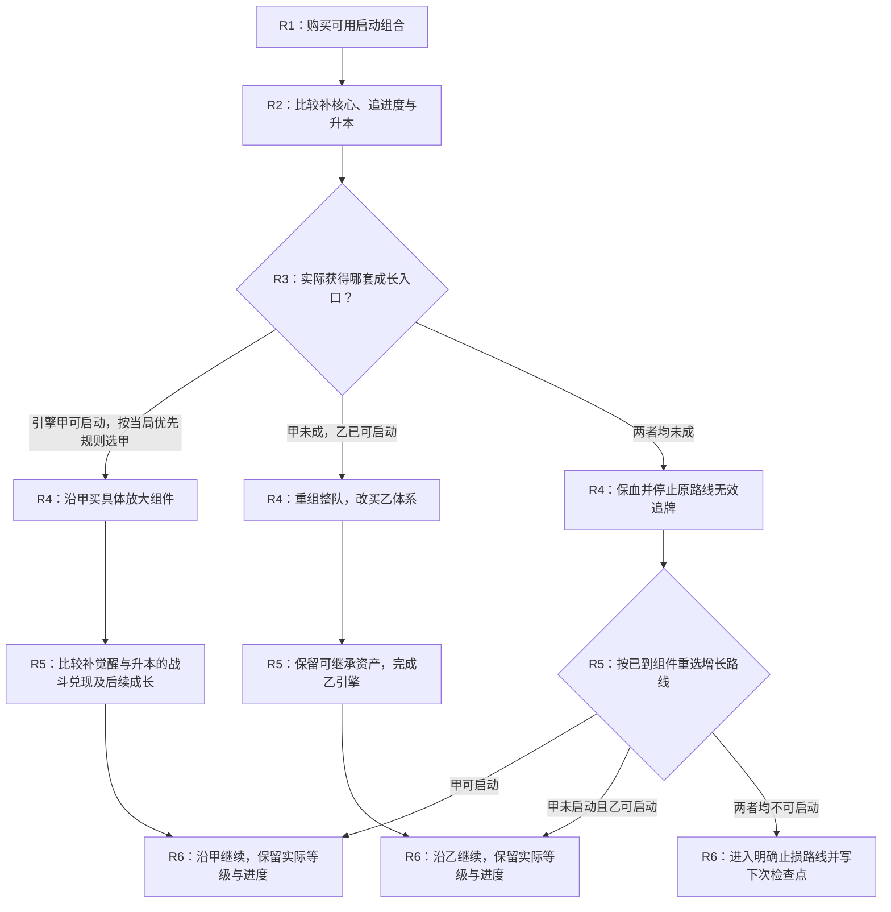

# 报告组织：按回合展示构筑决策树

用于构筑推荐、优化与实战运营。用户要求的报告是可随来牌选择的多路线决策图，先讲每回合怎么做，再讲成长与战斗分析。只有单一最终阵容、按棋手等级排列的阶段表或逐卡替代表，都不能作为默认完整交付。

## 开头：回合分支图

用一两句交代禁用、棋手是否已锁定、已有局面与研究是否实测，随后立即给可渲染的流程图。Markdown默认使用Mermaid flowchart，不需要额外插件；若交付载体不能显示Mermaid，则提供实际可看的SVG/HTML图，不能只交一段源代码。图复杂时拆成连续回合的几张分图，以节点ID衔接，保留真实分叉与汇合。

从零构筑且棋手未锁定时，在流程图前或R1节点补一段**初始入口与棋手筛选**：注明选用的A类标签、直接命中英雄数及其“母集候选/组件入口”角色；先给不依赖特定棋手的初始基线，再列机制、战斗、资源和时序缺陷，最后说明按哪个缺陷比较了哪些棋手。A类中直接命中英雄数≤3的标签只能作为定向外挂组件接入，不能把其全部命中卡写成阵容母集。棋手的牌源、经济或保护收益不能替代母集本身的战斗兑现。

图的横向或纵向主轴都是**R1、R2、R3……**，棋手等级只作为节点中的动作目标/结果。完整攻略从R1开始覆盖到主要路线收敛；之后写清每回合检查与已知关键回合动作。当前回合求助从已知R几开始，不虚构过去操作。

每个决策节点包含：

- **回合与当前路径**：例如R4，来自哪条开局，而不是仅写“中期/棋手3级”。
- **可观察条件**：哪些具体牌已到、各几张或何种觉醒进度，是否已有可用另一引擎、成长是否落后、战线是否能撑住。多个条件同时满足时给优先顺序，也覆盖都不满足的情况。
- **具体动作**：买哪些新牌/同名牌、是否升本及升到几级、追谁的觉醒或停止追谁、保留与换下的英雄。用表格补全文字时在节点注明对应行号。
- **下一站**：进入哪条成长体系、下次在哪个回合重判；不要用没有截止或出口的“再等等”循环。
- **唯一首选**：觉醒、过牌与升阶按 [机会成本比较](investment.md) 决出本节点动作。多个条件同时成立时写优先顺序，不写“可以A也可以B”。缺关键概率而不能证明最优时，给明确临时动作和会翻转的阈值，标明未证最优；禁止用默认觉醒或默认升本掩盖缺项。

早期分支体现可以换发动机和整队采购目标，中期体现保留资产的重构，后期体现继续强化或局部替换。路径不需要最后都回到原定阵容。已锁定的棋手在各条边上保持不变。

以下仅示范分叉结构，**不是游戏回合策略或合格成品**；实际报告须换成有原文、成长与逐回合预算依据的牌名、路线和决策：

## 紧接：逐回合动作表

表格与图使用同一节点ID。每个回合有明确默认动作与例外；不以“钱够就升”“看到就买”“缺谁换谁”代替决策。R1/R2/R3等分开写；后续若连续回合动作与条件完全相同，可以合并但明确每回合都执行什么、在哪一回合强制重判。不能将有升本、转型或觉醒取舍的回合藏进大区间。

| 回合/节点 | 进入条件 | 优先购买的新牌 | 已有英雄同名牌：追谁、只用单张谁、停止追谁 | 升棋手/刷新/停搜 | 当轮阵容变化与下一分支 |
|---|---|---|---|---|---|

先量化完成发动机觉醒与升阶接放大器的竞争收益，再定操作：包括升阶相差几回合、有效高阶曝光、晚到损失、天赋和人口。报告可展示关键节点的净收益差/翻转条件，不展示逐笔账。购买同名牌推进觉醒与英雄等级提升不是同一指标；不要默认见到重复牌就买，或把低阶全部单张当作固定策略。效果牌推进觉醒按真实资格与来源处理。

分支不能只列三套终局：还要让读者知道现在买哪组、停买哪组、如何经过中间盘转过去。暂时保血的分支要明确下一回合的增长出口，不能把无增长的低阶盘作为完整保底。后期列出为什么不再为迟到的原核心大转，何时仅做一两个组件替换。

操作区接着放与各分支相关的棋手技能用法、装备/天赋取舍与站位。细节随路线走，不把不兼容的多套装备和棋手能力合并成一套理想状态。

资源分配影响取舍的节点，写清当前主C/副C、等级/装备/效果牌给谁，以及何时改投保护、战斗位或成长位。分叉依据是实际来牌与战斗瓶颈，例如核心无法完成关键施法、对方前排未破或第二伤害源已可建立；不能写“单核永远优先”或只用全队等级低作为升级引擎的理由。

使用经济/检索功能位的路线还须列出停投与退出节点：何种可观察条件下停止追同名/定向强化，实际替代者到了先买谁、如何处理可转移资源、何时出售；替代者或转移牌未到时如何暂留及何时重判。不能仅在终局名单中无声删掉早期高等级功能位。

## 后半部分：解释增长和取舍

1. **获胜与资源转化路径：** 谁处理哪些目标，谁保护出手，投入如何经过属性/技能节点改变主C输出窗口或关键击杀；同步列实际等级分布、增长轨迹和启动时点，数据缺项给条件，不编等级。
2. **为何此时投资或换路：** 对比养主C、补保护/副C、扩生产或升阶，交代保留资产、停产/重建、锦囊与剩余兑现时间。原路线总增级较慢时先核对战斗优势，不能据此直接淘汰。
3. **对局证据与评分：** 按 [战斗评估](combat-evaluation.md) 给出双方关键目标/出手窗口、减员后变化、会翻转结论的控制/站位/回复等条件；区分局部算术与实测。分数对应具体回合/路径和同资源基线，不给整树平均分，也不把总级/木桩DPS/首杀当胜负证明。
4. **来源与验证：** 关键卡文定位、失败条件和待验证机制，区分推导与实测。

**费用账本不放入默认报告。** 累计收入、某回合可用能量、升级和购牌逐笔算式、预算是否允许该动作，都由agent逐路径内部核算。报告呈现核算后的“R几买/升/追/停/转”及可观察条件；不把预算校验当成用户要阅读的正文或附录。用户明确询问经济测算时再提供。可以保留独立的内部工作记录供复核，但不默认链接为报告阅读内容。

简短回答也应保留关键回合的分叉，不能退回只有终局七人名单。历史单阵容报告需重新按资源分配、战斗兑现与运营路径分析后才可作为当前推荐；不能仅把原表加几根箭头就称完成重构。
